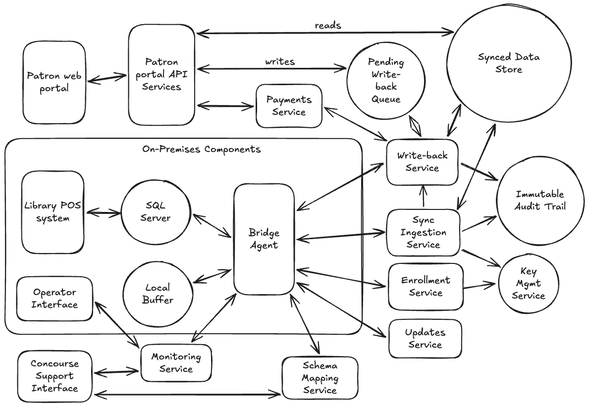

# Alex Randaccio Concourse Design Challenge Submission

This document describes the Bridge, the data synchronization system connecting the Maplewood Public Library's on-premises SQL Server environment with Concourse's cloud-hosted patron portal.

*Tool Disclosure: I used Claude to assist me as I reasoned through this design and drafted this document.*

---

# Architecture Diagram

---

# System Components

| Component | Responsibility |
|---|---|
| **Bridge** | The overall on-premises-to-cloud synchronization system described in this document. |
| **Bridge Agent** | The single compiled binary running on the library's on-premises server. Performs schema discovery, change detection, client-side encryption, transmission, and write-back execution. |
| **SQL Server** | The library's existing, unmodified operational database. |
| **Library POS System** | The catalog/patron-management software the library already runs. The Bridge Agent never interacts with this software directly, only with SQL Server. |
| **Local Buffer** | On-premises encrypted flat-file storage holding forward-sync data pending transmission. Not used for write-back instructions, which are never durably held on-premises. |
| **Operator Interface** | The on-premises status and alert surface presented to the Operator: first-run report, ongoing status indicator, plain-language alerts, and a one-click "report this" action that quietly sends current diagnostics to the Concourse Support Interface. |
| **Operator** | The library's non-technical on-site IT support role, responsible for installation and basic upkeep only — never log interpretation or configuration file maintenance. |
| **Enrollment Service** | Cloud service issuing a unique device identity and public/private key pair to each Bridge Agent at install time. |
| **Key Management Service (KMS)** | Cloud-managed service holding each installation's private key. Never exports it in plaintext; performs all decryption of data received from the Bridge Agent. |
| **Sync Ingestion Service** | Cloud endpoint receiving forward-sync batches from the Bridge Agent. Decrypts via KMS and applies changes to the Synced Data Store via version-conditional upsert. |
| **Schema Mapping Service** | Cloud service that receives discovery metadata and aggregate statistics (never raw data), applies mapping-confidence and sensitivity gating, and generates AI-assisted mapping rationales for review. |
| **Synced Data Store** | Cloud-side data store holding the current mirrored state of all six business entities, encrypted at rest. |
| **Pending Write-Back Queue** | Cloud-side queue holding patron-initiated actions (place/cancel hold, pay fine, update contact info) awaiting Bridge Agent pickup, encrypted at rest. |
| **Write-Back Service** | Cloud service that filters the Pending Write-Back Queue (removing instructions rendered moot by the latest forward-sync), delivers capped per-cycle batches to the Bridge Agent, and reconciles outcome reports against the queue. |
| **Payment Authorization/Capture Service** | Cloud service managing authorize-then-capture for fine payments, gated on Write-Back Service confirmation. |
| **Immutable Audit Trail** | Append-only, tamper-evident cloud log of every sync batch, write-back attempt and outcome, mapping decision, and outage event. |
| **Updates Service** | Cloud service hosting signed binary releases for Bridge Agent self-update. |
| **Monitoring Service** | Cloud-side service tracking Bridge Agent health, fallback-tier status per entity, and flagged conditions requiring attention. |
| **Concourse Support Interface** | The surface used by Concourse staff to review and confirm flagged schema mappings, and to view richer diagnostics and intervene on flagged operational conditions. Combines what would otherwise be a separate mapping-review queue and support/monitoring view into one staff-facing surface. |
| **Patron Web Portal** | The patron-facing website: account view, catalog browsing, checkout history, holds, fines, and contact info. |
| **Patron Portal API Services** | Backend layer behind the Patron Web Portal, mediating reads from the Synced Data Store and writes into the Pending Write-Back Queue and Payment Authorization/Capture Service. |

---
 
# Key Design Principles, Tradeoffs, and Assumptions
 
This section surfaces the reasoning threads that run across multiple parts of the design.
 
## Governing Principles
- **Production stability outranks sync freshness or cloud convenience in any conflict.** Wherever a choice existed between keeping the library's POS system fully responsive and keeping the cloud portal current, this design chose the former — deadlock priority, capped write-back batching, and paginated/off-peak-deferred large reads all follow from this one rule.
- **The on-premises SQL Server is the sole authority on business state; the cloud is authoritative only over sync bookkeeping.** The Synced Data Store is a mirror, not an independent source of truth. Write-backs are treated as proposals the on-premises database is free to reject; the cloud never overrides on-premises state, only reconciles what it has already been told.
- **No long-lived key capable of decrypting patron data is ever present on the library's server**, satisfied structurally (asymmetric encryption, agent holds only the public key) rather than procedurally (rotation policy, access controls).
- **Discovery-time data handling is held to the same PII-protection standard as the rest of the system, independent of how confidently an entity has been labeled.** Sensitivity is scored on each candidate's own characteristics, not inherited from its proposed classification, so a mislabeling error cannot silently bypass review.

## Notable Tradeoffs
- **Rejected a two-tier fast/slow synchronization pipeline** in favor of one uniform mechanism across all six entities. A fast/slow split initially seemed to match the brief's stated staleness tolerance for reference data, but tracing through the actual query cost showed the efficiency gain was small, while the complexity (and new failure modes, including cases where a "slow" entity contained fast-relevant fields, such as catalog availability) was not justified by that gain.
- **Rejected local, durable buffering for write-back instructions.** This was seriously considered, since it initially looked like the most consistent design. It was set aside once the durability question was traced through: the cloud already owns durability for pending write-backs (an un-pulled instruction is never at risk, since it simply waits in the cloud queue), so local buffering would have reopened the encryption model to solve a problem that doesn't exist.
- **Chose bounded, capped-per-cycle write-back execution over unbounded backlog draining.** This trades faster catch-up after an outage for consistent, predictable load on the production database in every cycle — consistent with the governing production-stability principle above.
- **Chose to keep raw row-level content strictly on-premises during schema discovery**, even where a bounded, sampled read to the cloud might have simplified the mapping pipeline. This was a deliberate choice to keep the "no raw patron data leaves the premises pre-classification" guarantee absolute rather than dependent on downstream handling.

## Material Assumptions
- **Each business entity, or the fields within it, can be reasonably distinguished by discovery** (e.g., availability status vs. descriptive catalog metadata) even though the underlying schema is unknown in advance. Where this assumption fails for a given customer, the design falls back to full-table comparison, at a higher production-impact cost.
- **The library's operational needs tolerate near-real-time, not real-time, patron-facing sync**, and a brief "pending" state in the portal for in-flight write-backs is an acceptable user experience rather than a defect.
- **Human review capacity exists within Concourse's own team** for low-confidence or sensitive schema mappings. This is not asked of the Operator, since the ambiguous cases requiring review are, by definition, exactly the ones an unfamiliar-schema judgment call could get wrong — the same failure mode the design otherwise hardens against. At consortium scale, review load is expected to track the number of *distinct* ILS platforms/schema patterns encountered, not the number of libraries: once a platform's schema signature has been confirmed once, future installs recognized as the same platform can reuse that confidence rather than starting from zero.

## Known, Accepted Limitations
- Heuristic and statistical PII-detection signals cannot guarantee detection of incidental PII embedded in unstructured free-text fields.
- An entity may be structurally unable to support efficient change detection in a given customer's environment (permanent full-scan fallback); this is surfaced as a monitored, alertable condition rather than a scenario the design claims to fully solve.
- Write reliability may vary by customer environment given unknown indexing and configuration; mitigations reduce but do not eliminate this variability.

---

# Data Flows

The Bridge operates as a repeating cycle once installed, bracketed by one-time setup steps and cross-cutting outage handling. This section traces data end to end through each phase.

## Setup & Enrollment (once per installation)
1. the Operator runs the installer and provides SQL Server connection details (a pre-created, least-privilege service account) and a one-time enrollment token issued by Concourse.
2. The agent registers with the cloud's Enrollment Service using that token, receiving a unique device identity and a public/private key pair — the private half is generated and retained exclusively in the cloud KMS and never transmitted to the Bridge Agent.
3. The agent connects to SQL Server, read-only, and begins schema discovery.

## Schema Discovery & Mapping (once per installation, then continuously re-validated)
1. For each business entity, the Bridge Agent identifies candidate tables/columns using system catalog views, scoring them against expected naming, row-count, and relationship patterns (Tier 1).
2. In parallel, every candidate — regardless of which entity it's proposed for — is independently scored for PII-like signals: column-name patterns first, and, where ambiguous, a small bounded on-premises sample (capped row count, not a full scan) checked against format heuristics (Tier 2).
3. The Bridge Agent also probes each entity's available change-detection mechanism, selecting the best available tier: native change-tracking, a watermark column, a monotonic key, or full-table comparison as a last resort.
4. Metadata and aggregate statistics only (never raw row values) are sent to the cloud's Schema Mapping Service, which uses an AI-assisted step to generate a human-readable mapping rationale.
5. A candidate entity auto-proceeds only if it clears two independent gates: sufficient mapping confidence, and no positive sensitivity signal. Any candidate failing either gate is routed to the Concourse Support Interface, along with its rationale and underlying signals, for review.
6. Confirmed mappings (automatic or human-reviewed) begin live sync. Every mapping decision, including who or what made it, is written to the immutable audit trail.
7. Each cycle, a cheap schema-metadata check (comparing a stored fingerprint of column names/types against the live catalog) runs for every mapped entity. Only on a fingerprint mismatch does that specific entity go back through full discovery and mapping — keeping routine drift detection inexpensive while still catching a vendor software update that silently alters a column.

## Steady-State Cycle (repeating)
Each cycle proceeds in three ordered phases:

**1. Forward sync**

For each entity, the Bridge Agent runs its selected change-detection query against SQL Server, encrypts any changed rows in memory using its public key, appends them to the local encrypted buffer, and transmits the buffer's contents to the cloud ingestion endpoint over HTTPS. The cloud decrypts via KMS and applies each record to the Synced Data Store using a version-conditional upsert (newer-than-stored only), with Holds additionally validated against its state machine. Every batch is logged to the immutable audit trail.

**2. Write-back execution**

Because forward-sync has just run, the cloud can first discard any pending write-back instruction that forward-sync has already rendered moot (e.g., a fine already waived on-premises). The agent then pulls a capped number of remaining pending instructions — never the full queue — bounding how many writes it commits to executing against the production database in a single pass. Each instruction is applied as a conditional SQL statement, executed as a short, narrow transaction with an explicit lock-wait timeout, and with the Bridge Agent's connection always set as the deadlock-priority "loser" so contention never causes a Library POS System transaction to fail. If a write returns no rows affected, the Bridge Agent performs a diagnostic read to distinguish a confirmed prior success from a genuine conflict with current on-premises state, which is treated as authoritative.

**3. Outcome reporting**

Results (successes, confirmed no-ops, and rejections) are encrypted and transmitted through the same pipeline used for forward sync. The cloud's write-back outcome tracker reconciles these against the pending queue, closes out completed items, releases or captures payment authorizations accordingly, and logs every outcome — including retries — as a distinct, immutable audit event.

## Outage & Recovery
If connectivity drops, the Bridge Agent continues forward-sync detection and encryption, buffering locally up to a configured maximum size; if that ceiling is reached, detection pauses rather than growing the buffer unbounded. On reconnection, the buffer drains immediately, streamed with local resource caps so the drain doesn't compete with the Library POS System for the shared server's CPU, disk, or bandwidth. The next detection cycle simply uses a wider watermark window — the same mechanism as steady state — paginated, and deferred to an off-peak window if the resulting read exceeds a configured size threshold. The outage period itself (start, end, backlog size) is logged as its own audit event.

## Updates & Monitoring
The agent periodically checks for a newer signed release and, if available, downloads and swaps in a complete replacement binary during off-peak hours. Throughout operation, it reports health, fallback-tier status, and any flagged conditions (a persistently degraded entity, an unresolved mapping) to Concourse's monitoring systems. the Operator sees only a simple status indicator and plain-language alerts; richer diagnostics are available to Concourse support.

---

# Security Model

The security model addresses three distinct problems: protecting patron data while it transits an untrusted network and briefly resides on a server outside Concourse's control, establishing a durable and revocable identity for each installation, and ensuring no long-lived key capable of decrypting that data ever exists on the library's premises.

**Authentication & Identity**

Each Bridge installation registers with the cloud platform at install time using a one-time enrollment token provided by Concourse. Registration issues the Bridge Agent a unique, per-install device identity and a matching public/private key pair (see below). This identity is the "actor" referenced in every audit record and is individually revocable — compromising or decommissioning one library's install has no effect on any other install.

**Encryption in Transit**

All agent-cloud communication occurs over HTTPS (TLS), consistent with the library network's outbound-only, port-443 constraint. No additional transport mechanism is required or assumed.

**Encryption at Rest — On-Premises**

The constraint that "long-lived master or decryption keys must not reside on the library server" is satisfied structurally, not procedurally: the Bridge Agent holds only the **public half** of an asymmetric key pair, generated at enrollment. It uses this key to encrypt data client-side, in memory, immediately upon reading it from SQL Server — before it is ever written to the Local Buffer. A public key confers no decryption capability, so even full compromise of the library server's disk yields ciphertext only. The matching private key resides exclusively in a cloud-managed Key Management Service (KMS) and never leaves it in plaintext form. This design also removes any online dependency for encryption: the Bridge Agent can keep encrypting and buffering data indefinitely during a network outage, since it never needs to fetch anything from the cloud to do so.

**Encryption at Rest — Cloud**

All cloud-resident data stores — the Synced Data Store, the pending write-back queue, and the immutable audit trail — use standard cloud-managed at-rest encryption (KMS-backed). This is a materially simpler requirement than the on-premises case, since the cloud is the trusted, managed side of the system by design; there is no equivalent constraint barring decryption keys from residing there.

**Database Credentials**

The Bridge Agent connects to SQL Server using a dedicated, least-privilege service account: read access for change detection, and narrowly-scoped write access for the specific write-back actions the portal supports (hold placement/cancellation, fine payment, contact info update). This limits the blast radius of a compromised Bridge Agent or credential to exactly the operations the system needs, and no more. Creating this scoped account is handled by a guided installer step that uses an existing administrative credential once, solely to create the low-privilege account, then discards it; where the Operator doesn't have suitable existing credentials, Concourse can create the account remotely during onboarding as a fallback.

**Key Rotation & Revocation**

Per-install key pairs allow revocation to be a clean, isolated operation — a library's device identity and key pair can be invalidated without affecting any other installation. Because the public key's exposure carries no decryption risk, rotation is a hygiene practice (bounding how much data any one key pair ever handles) rather than a security-critical, time-pressured operation.

**Write-Back Path**

Write-back instructions differ from synced data in one important respect: the cloud, not the Bridge Agent, owns durability for pending write-backs. A pending action (e.g., "place this hold") sits safely in the cloud's queue until the Bridge Agent is online to retrieve it — there is no scenario requiring the Bridge Agent to persist a write-back instruction locally across an outage. As a result, write-back payloads require only TLS-in-transit protection; the on-premises "buffered" encryption requirement does not apply, since nothing is durably buffered on that side of the transaction.

**Schema Discovery & PII Protection**

Discovery introduces its own data-handling boundary, separate from steady-state sync: candidate tables are scored for PII-like signals independently of which business entity they're proposed as, so a mislabeled table cannot bypass sensitivity review by virtue of being assigned an innocuous-looking slot. Any statistical validation needed beyond column-name heuristics is computed on a small, bounded on-premises sample — never a full-table read, and never transmitted off-premises as raw values. Only metadata and aggregate statistics reach the cloud's Schema Mapping Service, which means raw patron data cannot leave the premises during discovery regardless of how that downstream service is configured or operated.
 
**Immutable Audit Trail**

The audit trail uses write-once storage (e.g., object storage with Object Lock/retention enabled) rather than a database table protected by permissions alone. This guards primarily against *accidental* loss — a bad migration, an overbroad maintenance script, a misconfigured role — which is the more realistic risk here than deliberate tampering, and write-once storage prevents it structurally, even against a fully privileged account.

---

# Synchronization, Ordering, and Idempotency

This section covers how the Bridge determines what has changed, applies changes in a safe and repeatable order, and reconciles the roles of the on-premises database and the cloud-based Synced Data Store when they appear to disagree.

**Schema & Capability Discovery**

Because the customer's schema, indexing, and feature set are unknown in advance and cannot be altered, the Bridge Agent performs discovery per installation, then re-checks it every cycle via a cheap schema-metadata fingerprint comparison — full re-mapping only triggers on a mismatch, keeping routine drift detection inexpensive. For each business entity, it probes for the best available change-detection mechanism in order of preference: native change-tracking if present, a reliable watermark column, a monotonic key (suited to append-heavy/append-only entities), or full-table comparison as a last resort. The selected tier per entity is a logged, diagnosable decision, never a silent assumption.

**Schema Mapping**

Discovery also identifies which physical tables/columns correspond to each business entity, gated by two independent checks — mapping confidence and sensitivity — before any entity begins syncing live data. Full detail is covered under Security Model, given its data-protection implications.

**Steady-State Synchronization**

All entities share a single synchronization mechanism and cadence — there is no separate "fast" and "slow" pipeline. Splitting entities (or fields within them, such as catalog availability versus descriptive metadata) by update frequency was considered, but the actual efficiency gain proved small relative to the complexity and new failure modes it would introduce, and it could not reliably be done without assuming schema specifics the design is barred from assuming.

**Ordering & Idempotency (Forward Sync)**

Changes are applied via version-conditional upserts, keyed on each entity's natural key: an incoming record is only applied if its version/timestamp is newer than what is currently stored. This single mechanism resolves both ordering (a stale, late-arriving update cannot overwrite a newer one) and idempotency (a duplicate delivery is a safe no-op) without additional bookkeeping. Holds, which have a defined state machine (pending → ready → fulfilled/cancelled), receive an additional validation layer that rejects updates representing an invalid transition.

**On-Premises Authority vs. Synced Store Reliability**

The Synced Data Store and the on-premises database serve different kinds of authority, and the design is careful not to conflate them. The on-premises database is always the authority on what is actually true about the library's operational state; the synced store is a mirror of that state, accepted to lag slightly behind. The cloud is, however, the reliable authority on sync bookkeeping — has a given change already been applied, is a given delivery a duplicate — because it is not subject to the connectivity interruptions the on-premises side faces. Version-conditional upserts exercise this bookkeeping authority only; they never override or "correct" on-premises state. Where a write-back conflicts with current on-premises reality, the write is treated as a proposal that the database is free to reject, and that rejection is reported rather than forced through.

**Ordering & Idempotency (Write-Back)**

Each sync cycle proceeds in three phases: forward-sync, then write-back execution, then outcome reporting. Running forward-sync first narrows the conflict window: the cloud discards any pending write-back that the just-completed forward-sync has already rendered moot. The agent then pulls a capped number of pending write-back instructions per cycle — not the full queue — bounding how many writes it commits to executing against production in a single pass; a larger backlog simply drains over a few additional cycles rather than risking a large batch of writes in one pass. Write-back actions are implemented as conditional SQL statements, making them naturally idempotent and safe to retry. Where multiple actions for the same patron/item may be pending at once (e.g., a hold placed and then quickly cancelled), the cloud attaches a sequence to preserve the patron's intended order.

**Financial Integrity**

Fine payments use an authorize-then-capture pattern: the portal authorizes funds when a patron initiates payment but only captures them once the Bridge confirms the write-back succeeded, and releases the authorization if it is rejected. This prevents a patron from being charged for an action that did not, in fact, take effect.

---

# Handling Failures, Crashes, and Outages

This section addresses what happens when connectivity is lost, when a write contends with the Library POS System, and when a crash leaves an operation's outcome ambiguous — with production stability treated as the overriding priority throughout.

**Network Outages**

Given the library's consumer-grade, occasionally-unreliable connection, the Bridge Agent prioritizes the production database's normal operation over sync freshness whenever the two are in tension. During an outage, the Bridge Agent continues its normal detection cadence and encrypts and buffers changes locally, up to a configured maximum buffer size. If that ceiling is reached, detection pauses rather than allowing unbounded local growth — a deliberate, graceful degradation rather than a failure state.

**Recovery**

On reconnection, the buffer drains immediately, streamed and with local resource caps on concurrent throughput. This avoids overwhelming the cloud ingestion path — well-suited to absorb bursty load — while protecting the library's own shared server from competing with the Library POS System  for CPU, disk I/O, or bandwidth during the drain. If detection had paused, the next cycle's query simply uses a wider watermark window; this reuses the existing detection mechanism rather than requiring special-case logic. An unusually large resulting read (long outage, first-time backfill) is paginated, and deferred to an off-peak window if it exceeds a configured size threshold.

**Bridge Agent Process Crash Recovery**

A crash of the Bridge Agent process itself — as opposed to a connectivity or write failure — is handled by the same durability and idempotency mechanisms already described elsewhere in this design, rather than requiring separate machinery. Local buffer and checkpoint writes are atomic (written to a temporary location and only then made current), so a crash mid-write cannot leave either in a corrupted state. The sync checkpoint only advances after a batch has been durably buffered, never before — so a crash between reading from SQL Server and updating the checkpoint simply results in a small, overlapping re-read on restart, which the cloud's version-conditional upsert already applies safely as a no-op or a harmless reapplication. A crash mid-transmission is likewise safe: the cloud either received and applied a complete batch, or it didn't, and the unsent buffer contents remain in place to retry on the next cycle. In every case, restart behavior is "resume from durable local state," not a special recovery mode.

**Database Write Contention**

Write-back operations introduce a risk read operations do not: locking that can block or deadlock against the Library POS System's own transactions. This is mitigated structurally — the Bridge Agent always marks its own connections as the deadlock-priority "loser," guaranteeing that any deadlock is resolved by rolling back the Bridge Agent's transaction, never the Library POS System's — combined with short, narrow write transactions and explicit lock-wait timeouts, given the target environment's unknown indexing and configuration.

**Write Failures**

A failed or rejected write-back is reported back to the cloud and surfaced to the patron rather than silently retried into a possibly-incorrect outcome. Combined with conditional idempotent SQL, retries are always safe to attempt regardless of the failure's cause. If a write returns no rows affected, a diagnostic read distinguishes a confirmed prior success from a genuine conflict with current on-premises state.
 
**Full-Table Comparison Baseline Recovery**

The full-table comparison fallback (Tier 4) detects changes by diffing each scan against a local key-and-row-hash baseline from the previous scan. This baseline is kept and updated locally so the Bridge Agent can keep detecting changes without any cloud dependency, including during an outage. If that local baseline is ever lost (disk issue, reinstall), it is not a permanent gap: since the Synced Data Store already holds the same row-hash information for entities on this tier, the agent can rebuild its baseline from the cloud as a one-time recovery step, then resume normal local-only operation.

**Known Limitation: Environment-Dependent Reliability**

Because the customer's indexing and configuration cannot be assumed or modified, some environments may experience write contention more than others despite these mitigations, and an entity may be structurally unable to support efficient change detection (permanently falling back to full-table comparison). Rather than engineering around this indefinitely, the design treats a persistently degraded entity as a flagged, alertable condition visible to Concourse's operational monitoring, rather than something absorbed silently or allowed to violate the zero-production-impact requirement.

**Audit Trail as a Recovery and Forensics Tool**

Every sync batch, write-back attempt, mapping decision, and outage period is logged as a distinct, immutable event. Retried attempts are never collapsed into their original attempt; each is tagged with its outcome type (newly applied, confirmed prior success, rejected, or transient failure), preserving an honest record of what actually happened.

---

# Deployment & Operator Experience

This section describes how the Bridge is installed, operated, and maintained by a non-technical Operator, and how Concourse retains the visibility needed to support it remotely.

**Installation**

The Bridge ships as a single, statically-compiled binary with no runtime dependencies, package downloads, or containerization. SQL Server connectivity uses a pure-language TDS protocol implementation (e.g., Microsoft's official `go-mssqldb` driver) rather than ODBC, avoiding any runtime or C-library dependency and preserving single-binary compilation. The Operator Interface itself is delivered via native OS mechanisms — a system tray icon and notifications, plus a status page served locally by the Bridge Agent and opened in the Operator's existing browser — rather than a separately installed application, preserving the same constraint. The installer presents a small number of clearly labeled fields: SQL Server connection details (using a pre-created, least-privilege service account) and a one-time enrollment token issued by Concourse. Nothing further is required to begin operation.

**First Run**

On first launch, the Bridge Agent performs schema discovery and capability probing automatically, without requiring the Operator's input or judgment. It presents a simple, plain-language status summary per business entity via the Operator Interface rather than technical diagnostic detail. Any mapping requiring human confirmation is routed to the Concourse Support Interface, not to the Operator.

**Ongoing Operation**

The agent runs as an unattended background service. the Operator's ongoing interaction is limited to an at-a-glance status indicator and, if something requires attention, a plain-language alert — never a log file, stack trace, or configuration setting to interpret. Detailed diagnostics are directed to Concourse's own monitoring. If an alert doesn't resolve on its own, a single "report this" button — similar to a browser's crash-report prompt — quietly sends current diagnostic context to the Concourse Support Interface, closing the loop without asking the Operator to describe or diagnose anything.

**Updates**

The agent periodically checks the Updates Service for a newer version and, if available, downloads a complete, signature-verified replacement binary over HTTPS and swaps it in during off-peak hours — preserving the single-binary, no-dependency-resolution constraint even for updates. This requires no action from the Operator beyond, at most, an informational status change.

**Monitoring & Support**

The agent reports health and status to Concourse's monitoring systems, including fallback-tier status per entity, outage history, and any flagged conditions. This gives Concourse visibility via the Concourse Support Interface and the ability to intervene proactively, without placing that burden on the library's own operator.

# Prioritized Risk Register

### 1. Schema mismapping leading to PII exposure
**Impact:** High. Confusing a sensitive entity (Patrons) with a non-sensitive one (e.g., Authors) during discovery could expose private patron data through the public-facing portal — a confidentiality breach, not just a data-quality issue.

**Mitigation:** Sensitivity scoring is performed independently of the proposed entity label, so a mislabeled table cannot bypass review by virtue of being assigned an innocuous-looking slot. Any statistical validation beyond column-name heuristics runs against a small, bounded on-premises sample and is never transmitted off-premises as raw data — only aggregate signals and metadata reach the cloud's Schema Mapping Service. PII-bearing or low-confidence mappings require human confirmation via the Concourse Support Interface before going live.

**Known limitation:** Heuristic and statistical signals can still miss incidental PII embedded in an otherwise unstructured free-text field (e.g., a staff comment containing a phone number). This is an accepted residual risk rather than a gap the design claims to close entirely.

### 2. Write-back activity threatening production stability
**Impact:** High. Given unknown indexing/configuration, write-back operations (place hold, pay fine, update contact info) risk both lock contention with the Library POS System's own transactions and, if a large write-back backlog were drained in a single uncontrolled pass, degraded responsiveness at the circulation desk — directly threatening a stated core requirement (patrons placing holds/paying fines) and the zero-production-impact constraint.

**Mitigation:** The Bridge Agent always sets its own connections as the deadlock-priority "loser," guaranteeing any deadlock resolves in favor of the Library POS System, never against it; write transactions are kept short and narrow with explicit lock-wait timeouts; conditional idempotent SQL makes retries safe regardless of cause. Separately, the number of pending write-backs pulled and executed per cycle is capped, so a large backlog drains over several cycles rather than being committed in one pass.

### 3. Schema drift after upstream Library POS System updates
**Impact:** Medium-High. A vendor patch to the legacy software could silently rename or restructure a column the Bridge Agent depends on, causing sync to fail or — worse — silently mismap without anyone noticing until a support complaint.

**Mitigation:** A cheap per-cycle metadata fingerprint check detects drift on every mapped entity; only a mismatch triggers full re-mapping for that entity, which is then re-flagged rather than allowed to drift silently, and surfaced to Concourse's monitoring.

### 4. Large/unbounded read operations threatening production stability
**Impact:** Medium. Initial backfill, long-outage catch-up, or a persistent full-scan-fallback entity could place enough load on the shared server to affect Library POS System responsiveness, violating the most operationally sensitive constraint.

**Mitigation:** Mandatory pagination/chunking for any large read; size-threshold-triggered off-peak deferral for oversized operations; a persistently full-scan-tier entity is treated as an alertable condition rather than silently tolerated.

### 5. Local buffer/state loss or corruption on the library server
**Impact:** Medium. The Operator's server is a shared, non-technical-operator-managed machine — disk issues, unexpected reboots, or storage exhaustion could threaten the Local Buffer or checkpoint state the Bridge Agent depends on for outage resilience.

**Mitigation:** Bounded buffer size (a max-size ceiling triggers a pause, not unbounded growth); the cloud-side watermark/queue remains the ultimate source of truth, so local state loss degrades gracefully (re-sync from the last confirmed cloud checkpoint) rather than causing permanent data loss. This risk is scoped specifically to the read-side Local Buffer — pending write-back instructions carry no equivalent exposure, since their durability is owned entirely by the cloud-side Pending Write-Back Queue, not by any on-premises state.

---

*Considered but not ranked in the top five:* multi-library burst load on shared cloud ingestion at consortium scale (explicitly out of pilot scope); audit trail tampering by a privileged on-premises actor (mitigated architecturally by cloud-side, append-only storage, leaving low residual risk).